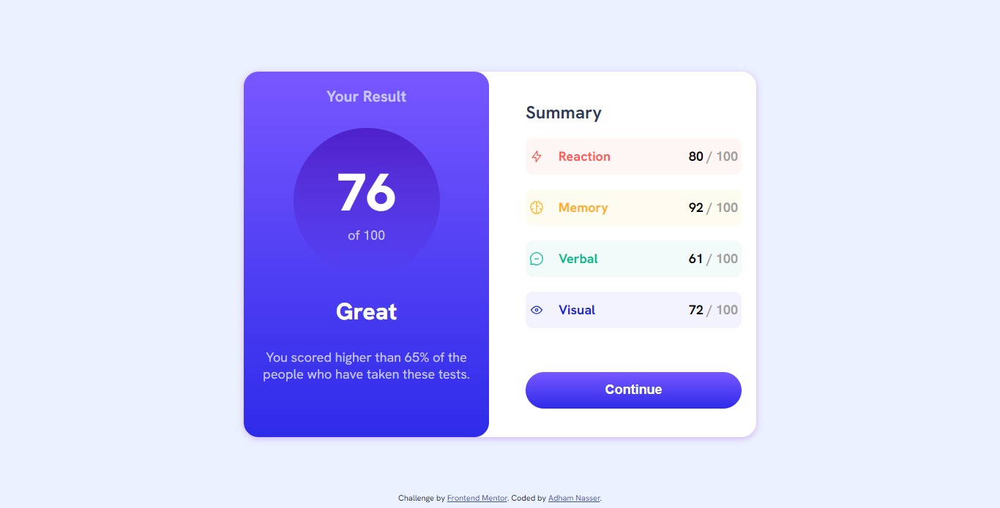

# Results Summary Component

This project is a responsive Results Summary Component created as a part of the Frontend Mentor challenge. The goal of the challenge is to build a visually appealing and interactive component that displays a user's result summary based on various test scores.

## Preview

## Features

- Display of user's result, score, and comparison to others.
- Individual score cards for different categories: Reaction, Memory, Verbal, and Visual.
- Responsive design for various screen sizes.
- Interactive "Continue" button to proceed.

## Technologies Used

- HTML5
- CSS3 (including CSS Grid and Flexbox)
- Google Fonts (Hanken Grotesk)

## Usage

- The main content of the component is contained within the `container` element, with left and right sides.
- The left side (`left-side`) displays the user's result summary, including their score, assessment, and a message.
- The right side (`right-side`) presents score cards for different categories (Reaction, Memory, Verbal, Visual) and an interactive "Continue" button.
- Media queries are used to ensure a responsive design on different devices.

## Customization

- You can customize the component's colors by updating the CSS variables in the `style.css` file.
- The Google Font used in this project is "Hanken Grotesk". If you want to change the font, you can modify the `font-family` property in the CSS.

## Credits

- Challenge provided by [Frontend Mentor](https://www.frontendmentor.io?ref=challenge).
- Coded by [Adham Nasser](https://github.com/Adham-XIII).
